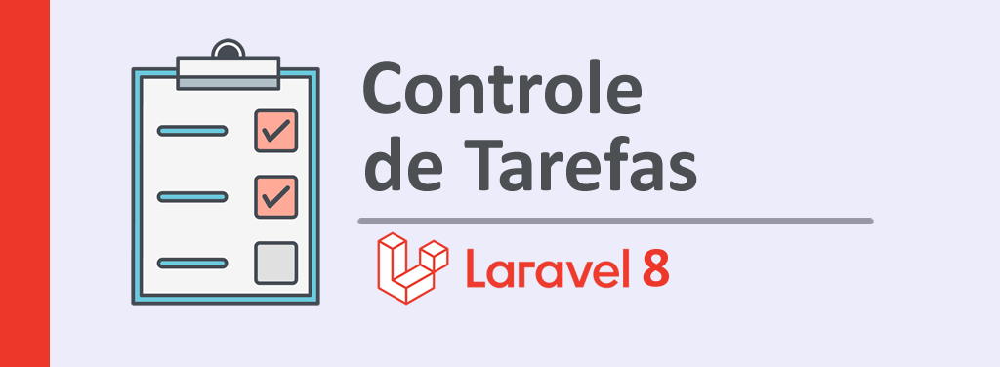

## Controle de Tarefas

A aplicação permitirá ao usuário cadastrar, editar, buscar, exibir e deletar os registros de tarefas.
Para rotas e recursos protegidos serão implementados registro, autenticação e verificação de usuário.
O usuário cadastrado poderá confirmar email usado em seu cadastro.
Para tarefas será possível:
- listar tarefas cadastradas com paginação
- notificação por email de nova tarefa cadastrada
- associar usuario a uma tarefa
- exportar relação de tarefas para XLSX, CSV e/ou PDF
A aplicação terá suporte para UTF8, CSS e quebra de páginas nas views PDF. 
abordagem rápida Laravel DOMPDF 

### Tecnologias utilizadas:
- IDE: MS VS Code
- Framework: Laravel 8.12
- Banco de dados: MySQL
- Servidor web: Apache
- Ferramenta de administração de BD: HeidiSQL Portable
- Laragon

 Este projeto é um estudo parte do curso Desenvolvimento Web Avançado com PHP, Laravel e Vue.JS (Seção 13 e 14) na plataforma Udemy disponível em:   https://www.udemy.com/course/curso-completo-do-desenvolvedor-laravel

### Os objetivos de aprendizado deste estudo são:
- Trabalhar com rotas, grupos e com os verbos HTTP 
- Trabalhar com o motor de renderização de views Blade
- Trabalhar com o desenvolvimento incremental de bancos de dados relacionais utilizando Migrations
- Trabalhar com o console Tinker
- Como manipular e validar formulários
- Como interceptar requisições e respostas utilizando Middlewares
- Como implementar as operações CRUD utilizando o Eloquent ORM
- Como implementar autenticação por Session
- Como lidar com o padrão de arquitetura MVC (Model, View e Controller)
- Como exportar arquivos nos formatos XLSX, CSV e PDF
- Como enviar e-mails
- Dominar os principais recursos do framework Laravel
- Como desenvolver projetos web de forma rápida e estruturada
- Como combinar os frameworks Bootstrap (CSS) e Laravel

### Sobre o Framework Laravel

### License

The Laravel framework is open-sourced software licensed under the [MIT license](https://opensource.org/licenses/MIT).
